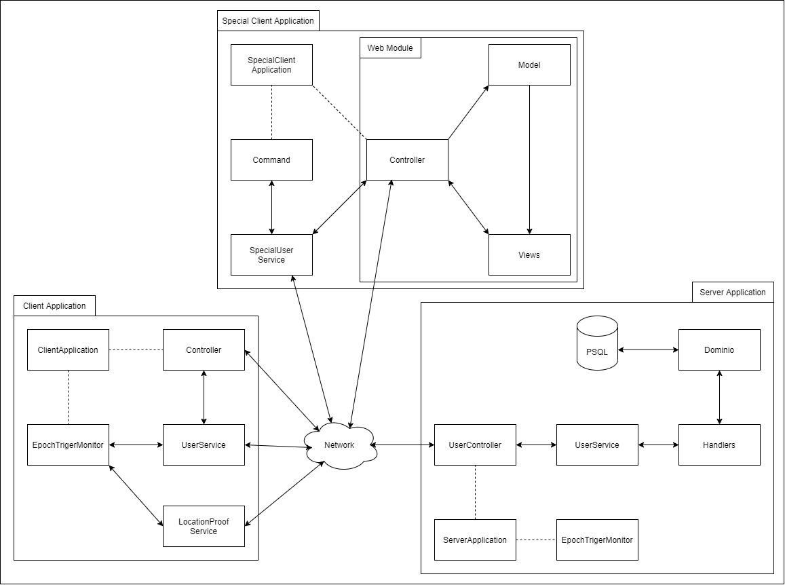

# Secure-Communication
The world pandemic we live in calls for tools for dependable location tracking and contact tracing. The goal of the project is to design and implement a “Highly Dependable Location Tracker”.

# Table of Contents
- [System Architecture Overview](#system-architecture-overview)
  - [Communication between entities](#communication-between-entities)
- [Deployment & Testing](#deployment-and-testing)

# System Architecture Overview

## Communication between entities
* All communication between Client and Server are encrypted and properly signed
* All communication between Special Client and Server are encrypted and properly signed
* All communication between Client and Client is in clear text but properly signed
* All communication between Special Client and Client is in clear text but properly signed
----
* Client can submit a report and obtain his reports from Server
* Client cans ask for proofs to other Clients
* Special Client can obtain report of valid users and obtain the users at a specific location at a given time
* \[EXTRA - Testing: Special Client can submit reports to Server and ask for proofs to other Clients (to act as a malicious user)\]

# Deployment and Testing

To deploy the project, the host computer requires to have Apache Maven, Docker, Docker Compose and PostgreSQL installed.
The following instructions are meant for linux operative systems (tested on Ubuntu 20.04):

Configuring the database:
- The database must operate locally on port 5432 with the user name 'postgres' and password 'root'. (This must be done in such a way that the
connection url is 'jdbc:postgresql://localhost:5432/sec').
- Create a database with the name 'sec': "sudo -u postgres createdb sec"

(This guide can be followed for the configuration https://www.digitalocean.com/community/tutorials/how-to-install-postgresql-on-ubuntu-20-04-quickstart-pt)

Configuring the clients and servers:
- Start a new terminal, as this current one will be used by docker or edit the "deploy.sh" script to send to the background the containers logging.
- Navigate to the "Deploy" folder.
- Give the execution permission to the "deploy.sh" script using the command "chmod +x deploy.sh".
- Execute the "deploy.sh" script with sudo permissions "sudo ./deploy.sh".

After executing the command there will be an initial delay of around X seconds before the clients start automatically sending location reports to the server. This delay is
used to allow all the applications to initialize.
